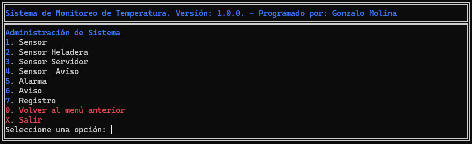
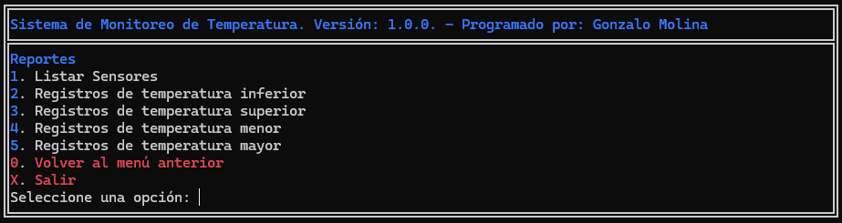

# Trabajo Práctico Final Coloquio de Programación

Se implementó un sistema de monitoreo de temperatura de sensores de servidores y heladeras. El sistema está compuesto por:
- Una capa de datos ORM implementada ad-hoc con una base de datos MySQL.
- Una capa de negocios implementada en base a controladores.
- Una capa de presentación implementada en base a vistas.

## ORM

La capa de datos se implementó completamente desde cero utilizando el patrón de diseño DAO, buscando simplicidad y eficiencia. Cada clase representa una tabla de la base de datos. Además, los campos de las tablas se mapean automáticamente cuando se realiza una consulta. Esto se logra utilizando los métodos mágicos `__get` y `__set`, y resguardando los datos en un array privado llamado `$fields`. Se provee de una abstracción de la conexión a la base de datos, utilizando el patrón de diseño Singleton. La clase `Database` se encarga de manejar la conexión a la base de datos. Además, se provee de una clase `RawQuery` que permite ejecutar consultas SQL directamente.

## Controladores

La capa de negocios se implementa utilizando el patrón de diseño MVC, sin llegar a ser MVC completamente; en cambio, se comporta como un sistema de 3 capas. Cada controlador se encarga de una funcionalidad específica. Los controladores se encargan de recibir las peticiones de la capa de presentación y devolver las respuestas. Para la comunicación entre la capa de negocios y la capa de presentación se utilizan las clases `Request` y `Response`. Estas clases se encargan de recibir y enviar las peticiones y respuestas.

## Vistas

Las vistas se implementan utilizando el patrón de diseño MVC, sin llegar a ser MVC completamente; en cambio, se comportan como un sistema de 3 capas. Cada vista se encarga de una funcionalidad específica. Las vistas se encargan de recibir las peticiones de la capa de negocios y devolver las respuestas. Para ello, se implementaron varias clases abstractas donde cada una se encarga de una funcionalidad específica, para finalmente implementar las clases concretas que se encargan de renderizar las vistas. Existen 5 tipos de vistas:
- Una vista para renderizar los menús.
- Una vista para renderizar las tablas.
  - Derivada de la vista de tablas, una vista de tablas que incluye un input de búsqueda.
- Una vista para renderizar los formularios, de la cual derivan:
  - Una vista para renderizar los formularios de creación.
  - Una vista para renderizar los formularios de edición.
  - Una vista para renderizar los formularios de eliminación.

## Pantallas

Menú principal:

Menú de Administración:

Menú de Reportes:

Listado de Sensores:

## Autor

Gonzalo Molina